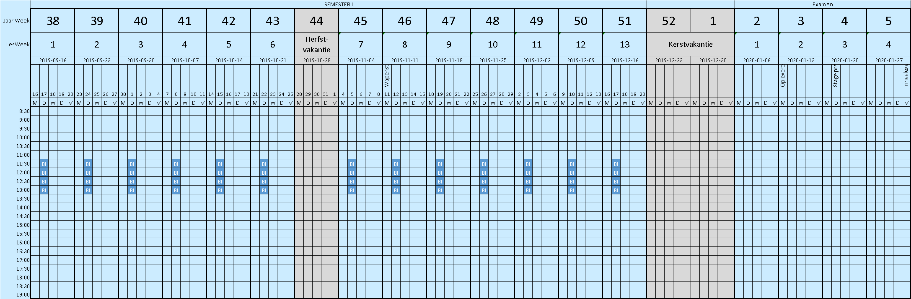

# Intro BI (32321/1700/1920/1/27)

## Korte omschrijving

Business intelligence en datawarehousing zijn ondertussen van onschatbare waarde geworden en onmisbaar in onze maatschappij. Je zal in dit OLOD kunnen proeven van realistische business intelligence projecten door de uitvoering van een project onder leiding van de lector en een IT bedrijf gespecialiseerd in big data.

## Kalender

(Onder voorbehoud)

## Algemeenheden cursus

|                                |                                                                          |
|--------------------------------|--------------------------------------------------------------------------|
| Studieomvang                   | 3 studiepunten                                                           |
| Onderwijstalen                 | Nederlands                                                               |
| Totale studietijd              | 75 uren                                                                  |
| Hoorcolleges                   | 12 uren                                                                  |
| Groepsleren                    | 12 uren                                                                  |
| Werktijd buiten de contacturen | 51 uren                                                                  |
| Volgtijdelijkheid              | Data Mining                                                              |
| ECTS                           | [Link](https://bamaflexweb.ap.be/BMFUIDetailxOLOD.aspx?a=127745&b=5&c=1) |

## Leerdoelen

- A.5. Architecture Design: Verklaart systeemarchitecturen en selecteert ze in functie van de behoeften, vereisten en gehanteerde standaarden.
- A.6. Application Design: Identificeert en herkent de verschillende gegevensstromen in een organisatie. Ontwerpt een softwaretoepassing
- D.10. Information and Knowledge Management: Formuleert en verklaart bedrijfsprocessen en identificeert de gegevensbehoeftes die daarmee samenhangen.
- E.1. Forecast Development: Schetst marktomstandigheden en beschrijft evoluties en trends.
- E.5. Process Improvement: Herkent en beschrijft methodes om belangrijke aspecten van ICT systemen (capaciteit, performantie en rendement) te meten en kengetallen (KPI's) te bepalen.
- F.1. Taakanalyse: Identificeert en herkent de verschillende gegevensstromen in een organisatie. Ontwerpt een softwaretoepassing. Schetst marktomstandigheden en beschrijft evoluties en trends.
- F.2. Strategisch handelen: Formuleert en verklaart bedrijfsprocessen en identificeert de gegevensbehoeftes die daarmee samenhangen. Identificeert de risico's die gepaard kunnen gaan met verkeerd beheer of gebruik van gegevens. Identificeert en herkent de verschillende gegevensstromen in een organisatie.
- G.1. Mondelinge communicatie: Communiceert efficiënt binnen de beroepscontext (conflicten beheersen/gesprek voeren/presenteren/onderhandelen/overtuigen/sensitief reageren). Communiceert op een vlotte wijze met betrokkenen en belanghebbenden en werkt er op een positieve wijze mee samen. Ontwerpt een softwaretoepassing
- G.2. Schriftelijke communicatie: Communiceert op een vlotte wijze met betrokkenen en belanghebbenden en werkt er op een positieve wijze mee samen. Communiceert schriftelijk efficiënt en effectief binnen de beroepscontext (media/spelling/grammatica/verslaggeving/rapportage/presentatie/briefwisseling). Ontwerpt een softwaretoepassing. Verklaart systeemarchitecturen en selecteert ze in functie van de behoeften, vereisten en gehanteerde standaarden.
- G.3. Relatiewerking: Communiceert op een vlotte wijze met betrokkenen en belanghebbenden en werkt er op een positieve wijze mee samen. Werkt klantgericht en omgevingsbewust
- G.4. Teamwerking en Leiderschap: Werkt constructief samen om collectieve resultaten te verwezenlijken

## Leerinhoud

### Theorie

- Aanleren verscheidene gegevensbronnen in bedrijven en bevoorradingsketens
- Achtergrond rond staging, datawarehousing, interfacing, datamodellen, ETL processen en OLAP kubussen
- Principe van single point of truth
- Introductie tot metagegevens

### Praktijk

- Use case in samenwerking met partner bedrijf
- Opzetten datawarehouse en staging area met SQL Server Integration/Analysis Services
- Introductie draaitabellen (in Microsoft Excel)
- Introductie BI-Tools
- Ontwerpen van een analysedocument met functionele en technische analyse, risicoanalyse en planning

## Evaluatie

- Continue evaluatie door de lector, verplichte aanwezigheid gedurende 1 dag per week
- Peer-evaluatie

## Toetsing

- Je krijgt de kans om in groep het werk te komen voorstellen
- Laattijdig indienen van een opdracht resulteert in een **0 score** voor die opdracht tenzij de student o.w.v. medische redenen of een andere overmachtssituatie de toestemming kreeg om de opdracht later in te dienen dan de opgegeven deadline.
- De student die omwille van medische redenen of overmacht de opdracht niet tijdig indient, kan uitstel aanvragen volgens volgende procedure:
  <small>De student uploadt binnen de 2 kalenderdagen, na de dag waarvoor hij een uitstel van afgifte wil aanvragen, via de iBaMaFlex-module ‘mijn afwezigheden’ een geldig medisch attest, zoals omschreven onder de begripsbepaling van het onderwijs- en examenreglement, of het nodige bewijsmateriaal voor de overmachtssituatie én brengt de verantwoordelijke lector via mail op de hoogte. De student die voldoet aan de voorwaarden voor uitstel van afgifte bepaalt in overleg met de betrokken lector een nieuwe inleverdatum.</small>
