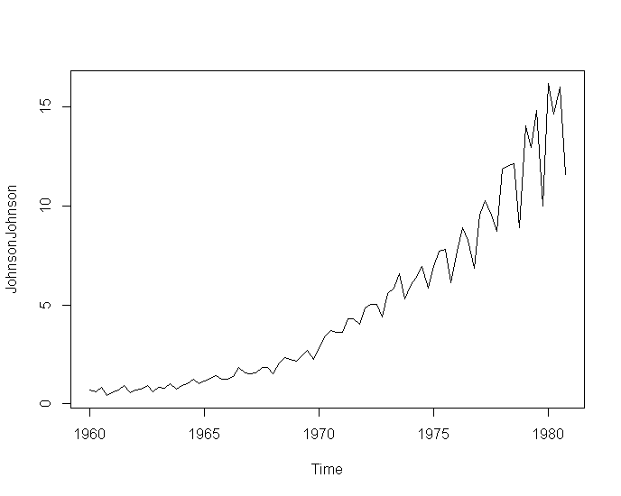
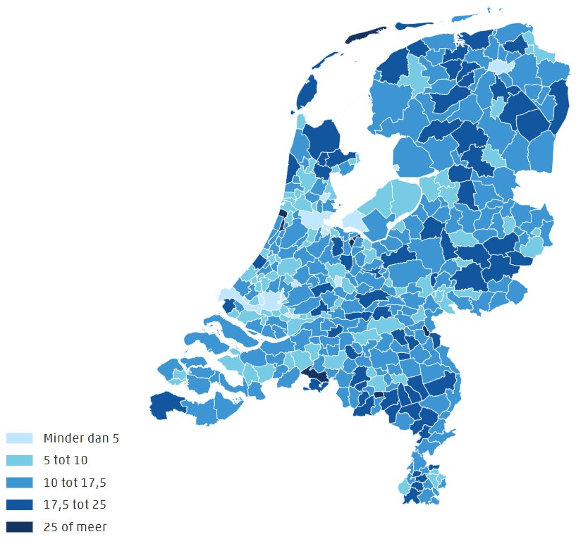
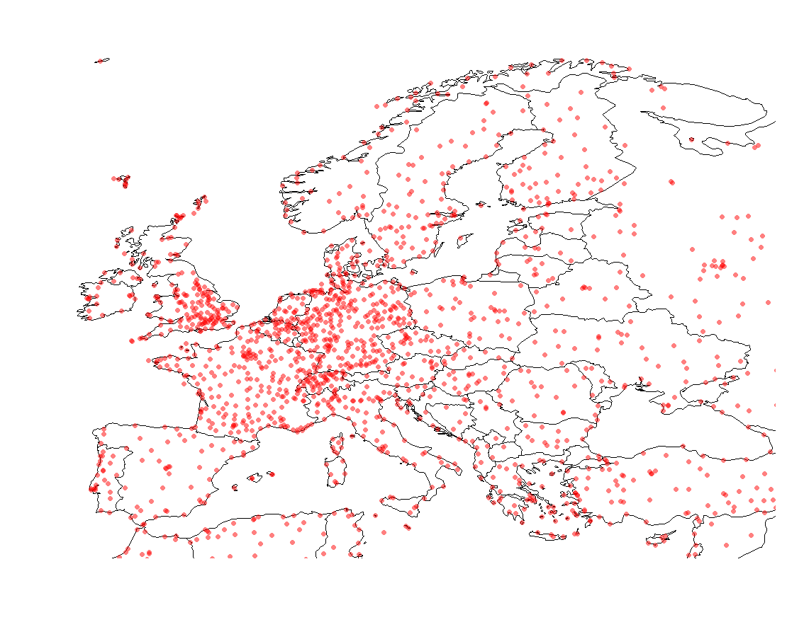
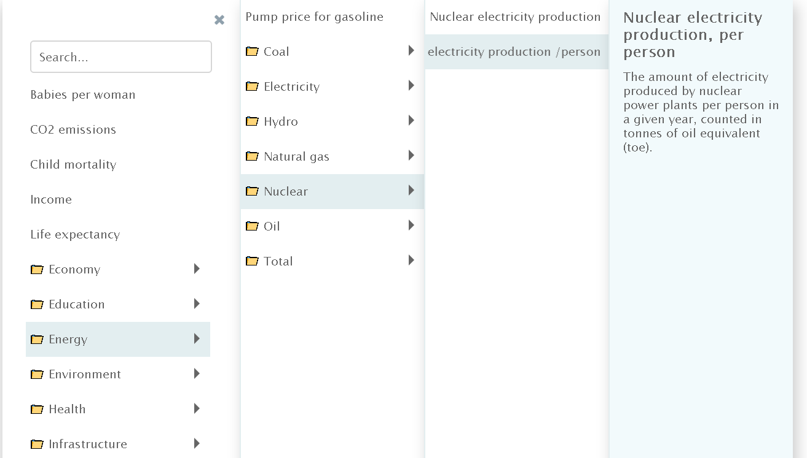
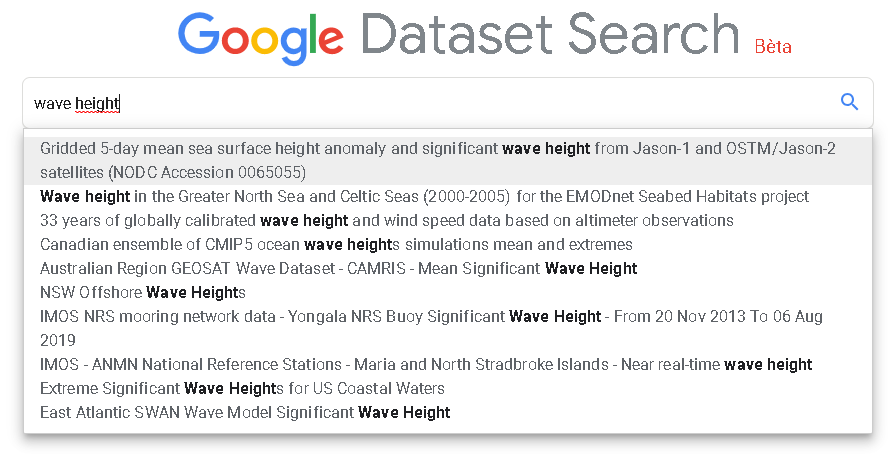

# Intro BI (32321/1700/1920/1/27)

## Known Knowns

Denk even terug aan de Rumsfeld Matrix. Laten we beginnen met de voor de hand liggende gegevens (*known knowns*).

- Verkoopcijfers
- Personeelsgegevens
- Klantenbestand
- Resultaten marktonderzoek

De drie eersten zijn **interne gegevens**, dat zijn gegevens die de onderneming zelf bezit. Het zal verplicht worden om de verkoopcijfers publiek te maken (voor Belgische bedrijven kan je hier aan via de [Nationale Bank](https://www.nbb.be/nl/balanscentrale/jaarrekeningen-raadplegen)), maar dan enkel de samenvattende statistieken. De ruwe interne gegevens worden meestal zo weinig mogelijk gedeeld omwille van privacy maar voornamelijk omdat zulke informatie door de concurrentie gebruikt - of misbruikt - kunnen worden.
De resultaten van een marktonderzoek (market research, landscaping) kunnen soms intern zijn (indien uitgevoerd door een medewerker van de onderneming) of **extern** (indien uitgevoerd door een derde bedrijf - al dan niet op bestelling - dat zich specialiseert in zulk onderzoek en de resultaten verkoopt).

## Key Performance Parameters

Het laagste niveau binnen de KPI hiërarchie worden soms de Key performance parameters genoemd. Het zijn de dingen die uiteindelijk gemeten kunnen worden op de werkvloer (operational measures). In DWH terminologie spreken we van **facts**.

> Facts (feiten) zijn de resultaten van metingen en tellingen van gebeurtenissen die zich op de werkvloer voordoen die het laagste niveau vormen van de KPI hiërarchie. Het gaat om die metingen die cruciaal zijn voor het bepalen van de KPI's hogerop in de KPI hiërarchie.

Voorbeelden:

- Aantal pakjes gescand
- Aantal verkochte eenheden
- Gemiddelde transportsnelheid

Facts kan je herkennen aan de volgende eigenschappen:

- Het gaat om metingen of tellingen
- Ze hebben een eenheid (in bovenstaande voorbeelden 'pakjes', 'eenheden' en 'kilometer per uur")
- Het gaat om informatie die cruciaal is voor het bekomen van de KPI's hogerop in de hiërarchie (kwaliteit, winst, efficientie, …)

Ben je op zoek naar beschikbare facts voor een bepaalde probleemstelling, voor een specifiek project of voor het opstellen van een DWH, telkens kan je jezelf deze vragen stellen:

> Welke gebeurtenissen zijn er relevant? Gebeurtenissen zijn dingen die op een bepaald ogenblik en op een bepaalde plaats optreden. Er is geen limiet aan wat als een gebeurtenis kan doorgaan en zeker niet alles zal relevant zijn voor jouw probleem, maar hier zijn alvast wat voorbeelden: Audits, scannen van pakje, zetten van elektronische handtekening, optreden van een fout, afgaan van het alarm, stroomonderbreking, plaatsvinden van een vergadering, aanwerving, &hellip;

## Tijd en Ruimte

Deze twee grootheden zijn veruit de meeste belangrijke **dimensies**. Dimensies op een grafiek zijn de assen waarlangs een bepaalde fact gemeten kan worden. Laten we naar een bekende (maar gedateerde) dataset kijken van de farmareus Johnson & Johnson:


<small>Bron: Shumway, R. H. and Stoffer, D. S. (2000) Time Series Analysis and its Applications. Second Edition. Springer. Example 1.1.</small>
<details>
<summary>
Verdieping: Hoe bekom je deze figuur in R?
</summary>
Na het opstarten van R geef je gewoon het volgende in:

```r
plot ( JohnsonJohnson )
```
</details><br/>

Het gaat om de kwartaalcijfers van 1960 to 1980. Deze dataset wordt vaak in educatieve werken rond tijdsreeksanalyses gebruikt om het effect van een multiplicatieve seizoensafhankelijk trend (seasonality) weer te geven. *Multiplicatief* betekent hier gewoon dat het seizoenseffect afhangt van de grootte van de waarde.

> Waar het hier om draait is dat we de **fact** *kwartaalcijfer* uitgedrukt hebben tegenover de **dimensie** *tijd*.

In het algemeen, wanneer men onderzoek doet naar de evolutie van gegevens in de loop van de tijd, spreekt van van **trend analyse**. 

Hetzelfde kunnen we nu doen voor ruimte. Onderstaande figuur laat zien hoe we bijvoorbeeld aantallen kunnen uitdrukken over de dimensie **ruimte**:



<small>[bron](https://autorai.nl/elke-merken-rijden-er-de-meeste-oldtimers-rond/)</small>

<details><summary>Nog een voorbeeld…</summary>
Stel je voor dat je voor jouw business afhankelijk bent van transport over de lucht en je zoekt uit waar ideale plek in Europa is om een nieuw hub te openen, dan wil je ondermeer weten waar de nabij gelegen luchthavens zijn:



Ja kan deze grafiek in R als volgt reproduceren:

```r
library(rworldmap)
airports <- read.csv("https://raw.githubusercontent.com/jpatokal/openflights/master/data/airports.dat", header = FALSE)
colnames(airports) <- c("ID", "name", "city", "country", "IATA_FAA", "ICAO", "lat", "lon", "altitude", "timezone", "DST")

newmap <- getMap(resolution = "low")
plot(newmap, xlim = c(-10, 40), ylim = c(40, 65), asp = 1)
points(airports$lon, airports$lat, bg = rgb(1, 0, 0, .5), cex = 1, pch=21, col=NA)
```
</details><br/>

Voor BI gegevens die op zulke wijze worden geanalyseerd per regio/land/provincie/&hellip; spreekt men soms van *Location intelligence*.

Tijd en ruimte zijn slechts 2 van de vele soorten dimensies, maar het zijn wel veruit de belangrijkste.

## Interne versus externe gegevens

> *Voordat je verder leest*: Denk eens na wat volgens jou interessante gegevens zouden kunnen zijn

<details><summary>Klik hier om een aantal mogelijke antwoorden te zien</summary>

*Interne gegevens*:

- Verkoopscijfers
- Product prijzen
- Klachten van de klanten
- Taken van de werknemers
- Algemene aanbiedingen
- Persoonlijke communicatie/aanbiedingen naar de klanten
- Web analyse data (Web analytics)
- Genomen beslissingen van het management
- Metadata (zie later)
- Intern gegeveneerde voorspellingen

*Externe gegevens*:

- Externe data die een invloed kan hebben op de concurrentie-positie, waaronder&hellip;
- Extern gegenereerde trends (google trends, financiële trends, &hellip;)
- Sociale media ((Twitter, Reddit, Facebook, &hellip;)

</details><br/>

## Interne Media

Veel van de gegevens intern aan de onderneming worden bewaard in afzonderlijke, speciaal daarvoor voorziene bestanden of de fysische tegenhangers zoals rekenbladen, werkboeken, documenten, databanken, &hellip;. Vaak zijn er echter nog andere bronnen zoals audit-rapporten, logbestanden, videobeelden, &hellip; waar men niet onmiddellijk aan denkt.

## Externe Media

Externe gegeven kunnen teruggevonden worden op internet. Voorbeelden zijn de vele open-data initiatieven:

- [US Open data portal](http://data.gov)
- [Europese Open data portaal](http://open-data.europa.eu/en/data/ )
- [US Census Bureau](http://www.census.gov/data.html )
- [Socrata](http://www.socrata.com/discover/)
- [Brits open data platform](http://data.gov.uk/)
- [Canadese open data site](http://www.data.gc.ca/)
- &hellip;

Er zijn ook ondernemingen en andere organizatries die heel wat gegevens ter beschikking stellen:

- [Amazon Web Services public datasets](http://aws.amazon.com/datasets) met wetenschappelijke gegevens zoals het 1000 Genomes Project en satellietbeelden van NASA maar ook [Common Crawl](https://registry.opendata.aws/commoncrawl/), het resultaat van een web-crawler die data van 25 miljard web pagina's heeft bewaard.
- [Facebook](https://developers.facebook.com/docs/graph-api) databank
- [Data-world](https://data.world/)
- [Gapminder](https://www.gapminder.org/data/):



De [Forbes](https://www.forbes.com/sites/bernardmarr/2016/02/12/big-data-35-brilliant-and-free-data-sources-for-2016/#14cabf5bb54d) website vat nog een aantal gegevensbronnen samen en via deze specifieke [Google lab](https://www.google.com/publicdata/directory) kan je zoeken naar nog meer datasets:



Toch is het belangrijk niet enkel op het internet te vertrouwen. Het probleem is met internet ondermeer dat eenieder die actief is in het zelfde domein ook diezelfde data ter beschikking heeft waardoor de kennis van deze bronnen geen competitief voordeel garandeert. Daarom is het belangrijk om ook in de fysieke wereld een groot netwerk van industrie experten te onderhouden en deel te nemen aan allerhande beurzen en conferenties.

## Metadata

Metadata is **data over data**. Laten we eens een aantal voorbeelden bekijken:

*Capteren van data*:

- Wanneer vond de gebeurtenis plaats
- Data leverancier
- Waarom ontbreken sommige gegevens
- Wat is het onderscheidend vermogen
- Hoe groot zijn de foutenmarges
- (Ingeschatte) Betrouwbaarheid van de data
- Nauwkeurigheid
- Frequentie van opvraging
- Privacy-gevoeligheid van de data

*Voorbehandeling van data*:

- Stappen (algoritmen, versies, &hellip;) die nodig zijn in de voorbehandeling van data
- (Indien meerdere) De namen van de personen die instaan voor de voorbehandeling
- De datums waarop de voorbehandeling werd uitgevoerd
- Resultaten van vooropgesteld kwaliteitstesten of andere analyses

*Data analyse*:

- Wie heeft de analyse uitgevoerd
- Hoelang heeft de analyse geduurd
- Strategieën waarbinnen de analyse valt

> Het is belangrijk te begrijpen dat metadata ook data zijn

## Generating Data

Natuurlijk is er de optie om zelf data te genereren. In principe is dat iets dat typisch in het domein van de wetenschap valt omdat hierbij strikte deontologische regels te volgen zijn. De regels hebben er eigenlijk allemaal mee te maken dat de waarnemer zeker is (en dat ook kan garanderen) dat de waarnemingen betrouwbaar, accuraat, precies en relevant zijn. Dit is een niet te onderschatten taak en er is heel wat ervaring nodig om dit te kunnen bereiken. De correcte manier om dat te doen valt buiten het bereik van deze cursus maar geïnteresseerde lezers kunnen hiermee beginnen:

Carey, S. S. (2011). [A beginner's guide to scientific method](https://pdfs.semanticscholar.org/f438/02e46e7f1deadeb53f8f13d9cb78e55eb5ae.pdf). Cengage Learning.

