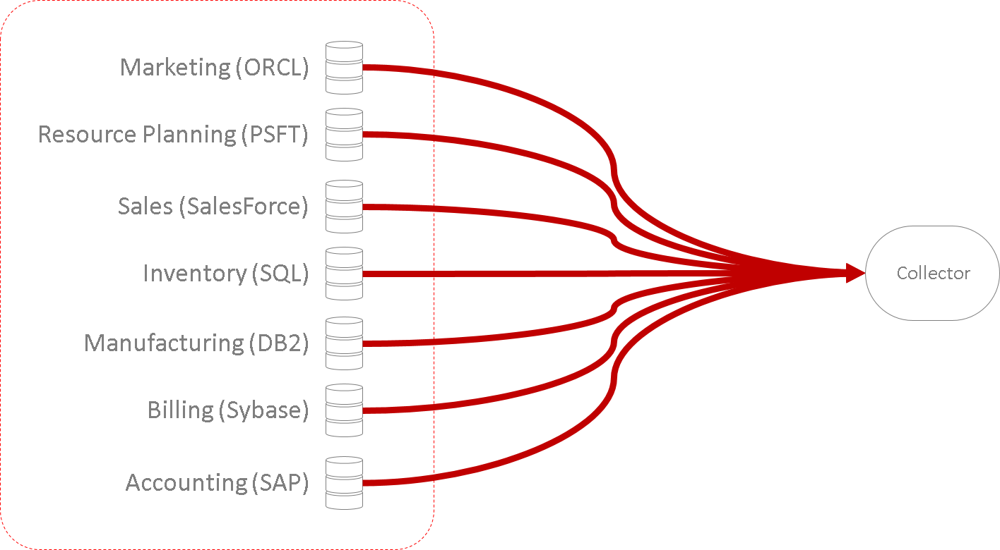
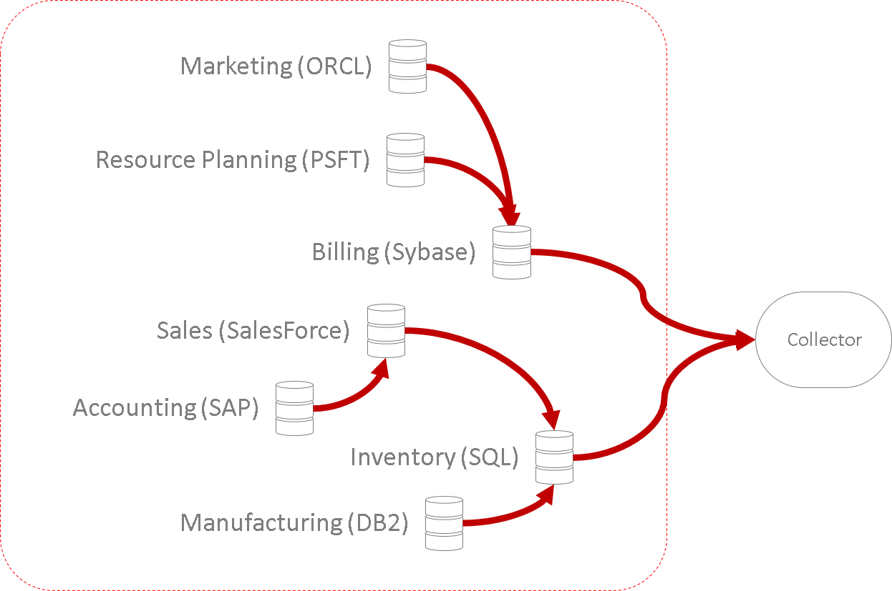
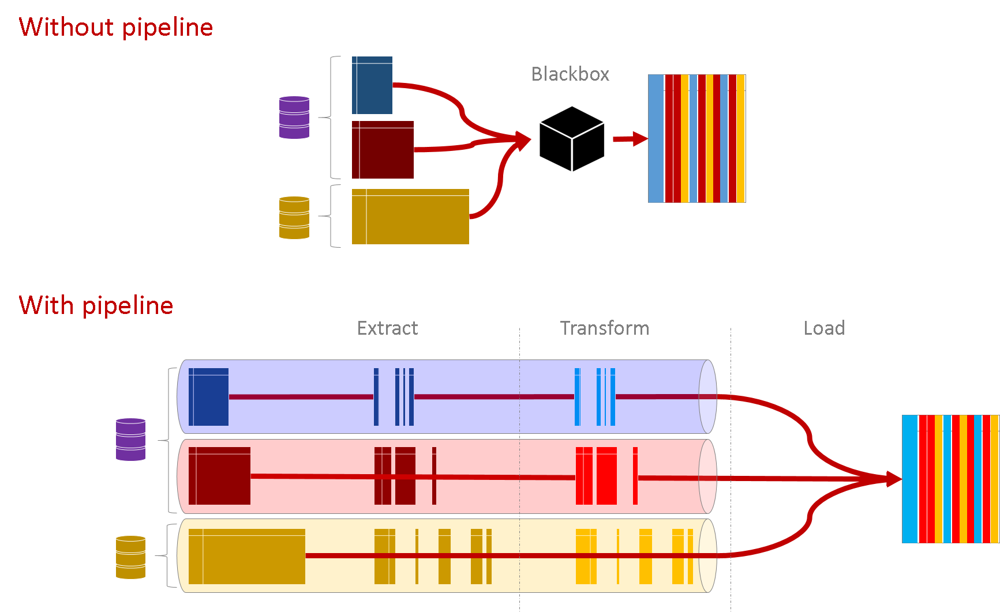
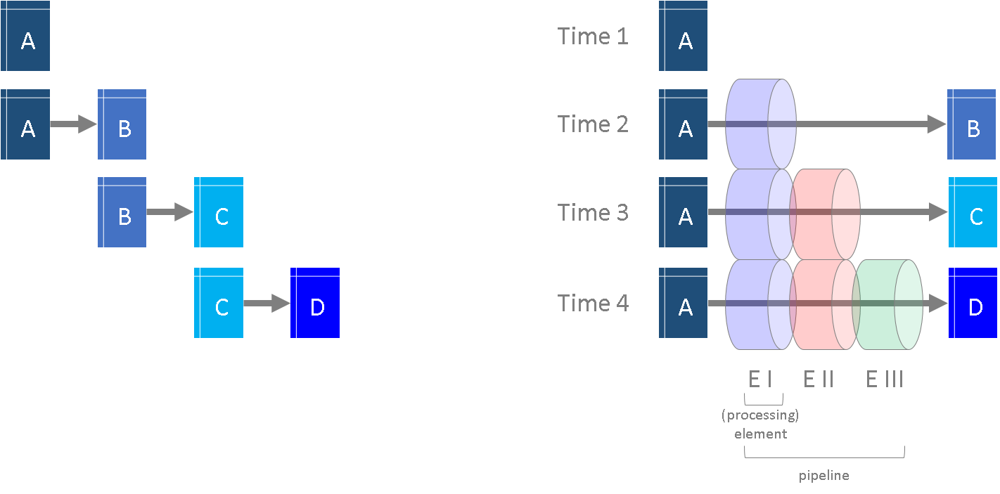
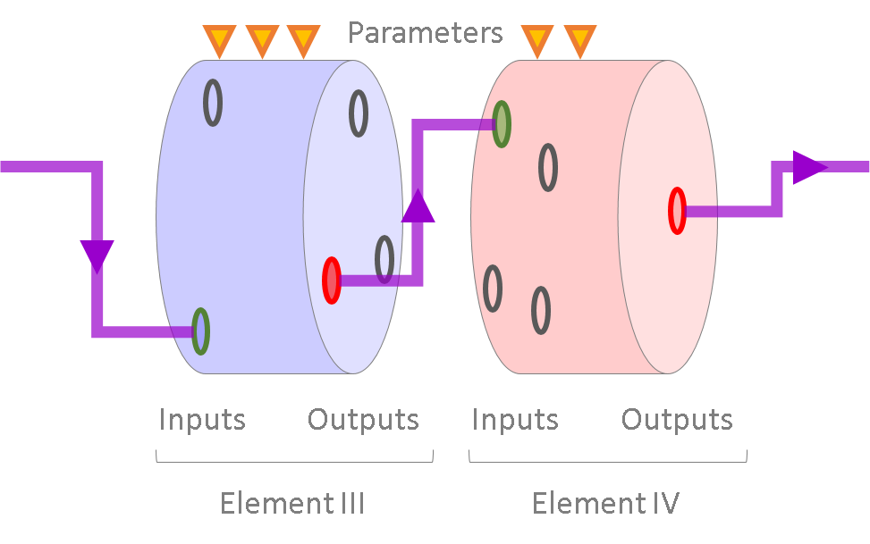

# Intro BI (32321/1700/1920/1/27)

## Het Nut van Integratie



Vele interne bronnen zullen verschillende databanken en verschillende data formaten gebruiken.

> Het nut van data integratie kan men in vier punten samenvatten:
>
> - vereenvoudiging - het is gemakkelijker om het overzicht te bewaren en een begrip te krijgen
> - méér integriteit betekent dat er gemakkelijker gequeryd kan worden (data wordt veel toegankelijker)
> - bevordert samenwerkingsverbanden en data-geletterdheid van werknemers

Bijvoorbeeld wil je de productie (automatisch) laten bijsturen op basis van verkoopscijfers, dan zal je eerst een *view* willen creëren. Hiervoor wil je de gegevens van Sales en Manufacturing samenvoegen en in het geval zoals getoond in het schema hierboven zou dat betekenen het samenvoeggen van SalesForce data en data uit een IBM DB2 databank. Het gevolg zal zijn dat je een query kan uitvoeren zoals dit:

```sql
SELECT
	P.ID,
	AVG(M.Productieduur),
	SUM(V.Aantal_Verkocht)
FROM Product as P
	INNER JOIN Verkoopscijfers AS V ON V.Product = P.ID
	INNER JOIN Manufacturing as M ON M.Product = V.Product
WHERE
	V.Jaar = 2018 AND V.Kwartaal = 2 AND M.Type = "Planned"
GROUP BY P.ID
```

Het alternatief voor het integreren van de verscheidene databronnen is het verbinden van de databanken:



Vele databank systemen laten inderdaad toe om met externe databanken te verbinden. Het verbinden van de databanken onderling brengt echter nogal wat nadelen met zich mee:

- tijdrovend wanneer het om vele databronnen gaat
- brengt risico's met zich mee want méér afhankelijkheden
- vergt meer kennis en onderhoud
- moeilijker om stapsgewijs te upgraden naar nieuwere technologieën

## Integratieproces

Het integratie proces begint typisch met het voeren van gesprekken met de specialisten van de afzonderlijke databronnen. Dit zijn bijvoorbeeld een aantal vragen die men tracht te beantwoorden:

- Welke data zijn er beschikbaar?
- Zijn er bepaalde toelatingen nodig om de data (of bepaalde delen ervan) in te kijken en te transfereren naar een centrale DWH?
- Hoe kan er met de data geconnecteerd worden?
- Zijn er ergens nog oude historische bronnen beschikbaar die nuttig kunnen zijn?
- Heb je van de gegevens ergens *dictionaries* of kan je van elke dataset een extract van een aantal rijen meegeven?

## Data Pipeline

Na de eerste verkennende gesprekken is het de bedoeling dat er een soort *pipeline* wordt opgezet voor het integreren van de gegevens. Dit is niet verplicht maar biedt héél wat voordelen.

> Het principe van een pipeline is uiterst belangrijk en houdt in dat er meer aandacht besteed wordt aan het integratie proces zelf. Je kan een data integratie pipeline een beetje vergelijken met het principe van een productielijn.


<small>[Bron](https://nl.wikipedia.org/wiki/Massaproductie)</small>

Het schema hieronder probeert het verschil duidelijk te maken tussen werken mét pipeline versus werken zonder pipeline:



Het resultaat van een data integratie is hetzelfde, mét of zonder pipeline, maar de ontwikkeling ziet er meestal anders uit:



Elk element van een pipeline heeft telkens een set van outputs. Optioneel bezit het ook eens set van inputs en een set van parameters:



Omdat er méér focus is op het proces en minder op de eigenlijke tussenstappen van de data integratie zorgt een pipeline ervoor dat men de data integratie gemakkelijker kan:

- **reproduceren** - andere krijgen een beter overzicht van het integratie proces
- **testen** - omdat men voor elke element precies kan nagaan wat de inkomende en uitgaande interfaces zijn
- **versioneren** - elk element krijgt een eigen versienummer
- **samenstellen** - op basis van de interfaces kan men bijvoorbeeld op zoek gaan naar alternatieven voor een welbepaald element van de pipeline
- **uitwisselen** - het wordt eenvoudiger om elementen (of hele pipelines) uit te wisselen met andere BI specialisten

Er zijn ook een paar nadelen aan het gebruik van pipelines (zie bijvoorbeeld [hier](https://en.wikipedia.org/wiki/Pipeline_(computing))) en het vaakst aangehaalde is dat het méér tijd kost. Die tijd die je op korte termijn verliest win je echter terug op lange termijn. Zie het dus als een investering.

## ETL

ETL staat voor **Extract, Transform and Load**. Het vat de drie activiteiten samen die in een typische data integratie pipeline voorkomen, in die volgorde. De eerst activiteit (*extract*) staat voor het extraheren van de nodige ruwe gegevens. Het idee is om eerst een subset van relevante gegevens te maken en pas daarna tijd en energie steken in het 'opkuisen' ervan. Dat opkuisen maakt deel uit van de tweede activiteit (*transform*). Behalve opkuisen bestaan er natuurlijk ook nog tal van andere transformaties. Tenslotte moeten alle afzonderlijke datalijnen worden samengebracht in de DWH (*load*).
