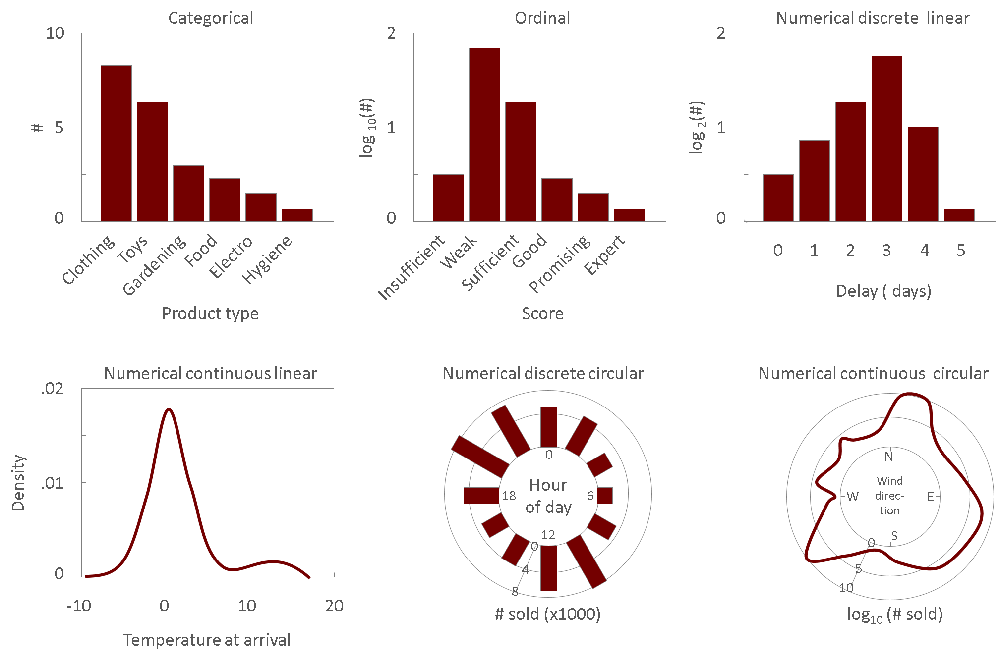
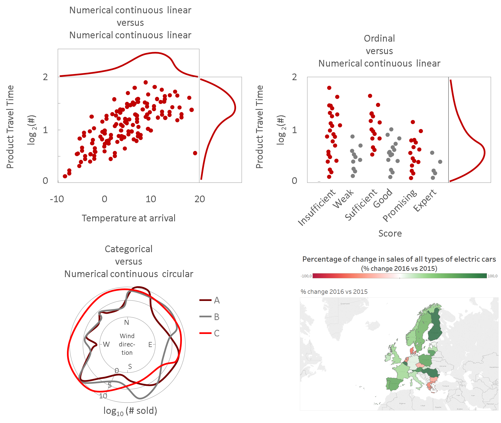
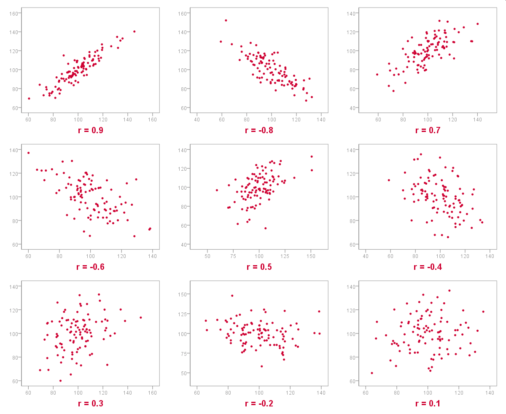
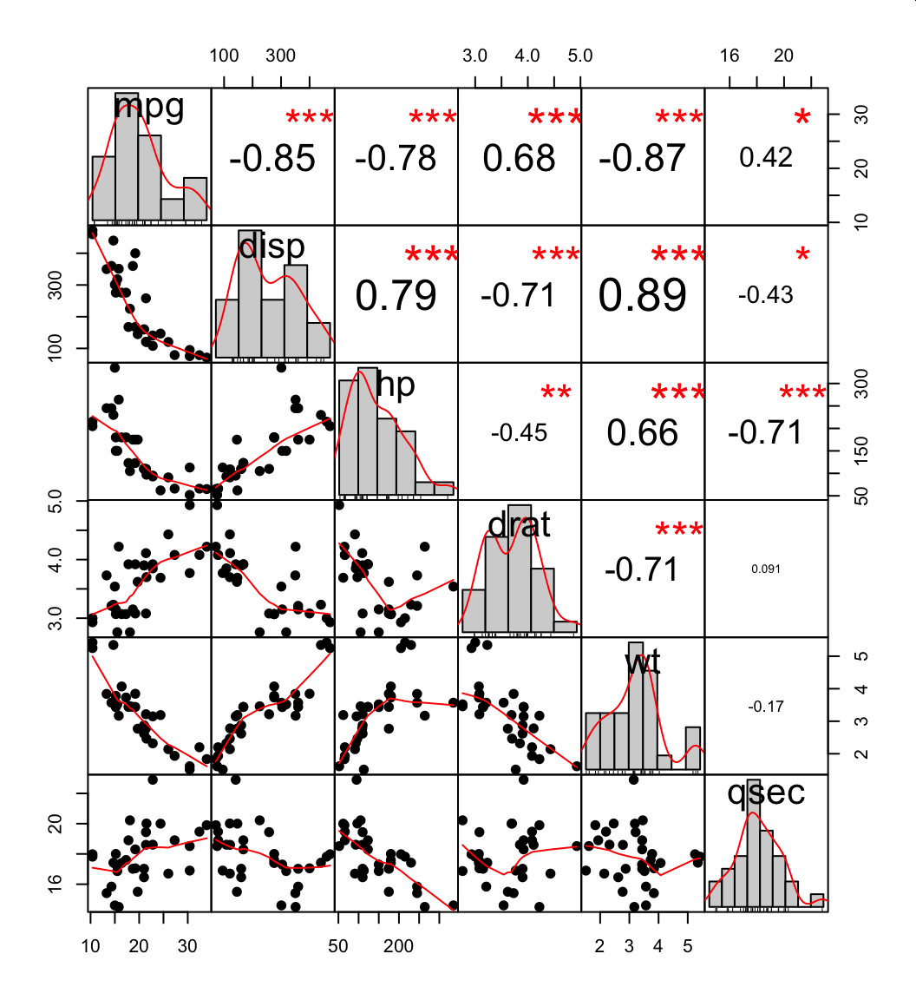

# Intro BI (32321/1700/1920/1/27)

## Data Exploration

### Why is there a need to explore the data

> Here are the main reasons to perform an exploratory data analysis (EDA)

- **Understanding** - Gain insights in the data and the process behind data generation
- **Quality** - Validate the data and it's source against quality criteria
- **Appropriate** - Validate the data against a set of assumptions
- **Reliability** - Check for artifacts and asses reliability of the data and it's source
- **Informative** - Evaluate the information content of the data ans the amount of missing values
- **Applicability** - Evaluate whether the data could answer the set of predefined questions

### Quartet of Anscombe

By using an extreme case of fabricated data, Francis Anscombe has shown how summary statistics can be misleading. In the quartet of Anscombe, he shows four distributions of a 2-dimensional dataset that look very different but still have:

- the same mean in x and y
- the same variance in x and y
- the same correlation to within two decimal points
- the same intercept and slope to within two decimal points

Agreed, this is an extreme case unlikely to occur in real data, however, real data is multi-dimensional and may well have multiple correlations that are far more complex. Hence the above serves as an argument to represent the data graphically.

### Systematic Exploration

Follow these steps for a successful EDA:

1. Glance at the data without doing any manipulation just yet
2. Read the description of the dataset
3. Observe the shape of the dataset
4. If applicable, understand what each row stands for, does it make sense then to have that any rows?
5. For each feature:
    1. Read the feature's description and try to figure out what information it conveys
    2. Decide whether to keep the feature or drop it (if drop, go to next feature) based on the needs of the company, the mission, vision and strategies
    3. Have a first glance at the feature (see below)
    4. Investigate the feature's distribution (see below)
    5. Consider measuring information content
    6. Make some notes about your plans for that feature
6. *Break here to revisit your EDM*
7. Explore pair-wise correlations among features and consider examination of 'multiple correlation'-effects

You can go on doing more complex exploration, but these fall outside of the scope of this course.

### Rows and Columns

Data in tabular format is typically organized to have one row for each subject or action of interest and to have several columns that convey information on that subject or action.

> Columns, then, are the **features** and rows the **instances**.

### Unstructured versus Structured Data

The above description of features and instances are only valid for structured data. But there is also something like unstructured data:

<small>[Bron](https://www.google.com/url?sa=i&source=images&cd=&ved=2ahUKEwiorNOnvvnkAhXSJlAKHW4cAz4QjRx6BAgBEAQ&url=https%3A%2F%2Flawtomated.com%2Fstructured-data-vs-unstructured-data-what-are-they-and-why-care%2F&psig=AOvVaw3wF3NRYAhlshRUc2XnPEdu&ust=1569965210307819)</small>

Simply stated, data that does not reside in a table is typically unstructured (also XML/JSON may fall in this category). Typically, the goal is to gauge whether it is worthwhile to extract features out of the unstructured data and, by doing so, turning it into structured data. Examples of such extracted features are:

- The client company extracted from an e-mail
- Labelling validation extracted from images of products
- The attendees extracted from meeting minutes

### Data Types

The data type of an given, extracted or calculated feature can be accomplished by placing the feature along three axes:

- **Numerical vs. nominal**, where numerical means you can do calculations with it (such as addition) while nominal data items are character strings
- **Continuous vs discrete**, where continuous means that between two values there are infinitely many other values
- **Circular vs. linear**, where circular means that the axis can be 'folded' upon itself to form a circle

### First Glance

Once the data has been collected in the staging area, you can start your observations. How to go about that is entirely up to your personal preferences, but here are some tips:

1. Delay data manipulation until you have had a first look at the data
2. Estimate or measure the proportion of missing values
3. Try to guess the **true data type**
4. Look carefully at the *head* and *tail* of the table, as well at a random sample of at most tens or hundreds of data items
5. Consider printing the data excerpts (say a random sample of 50-200 items) on a sheet of paper for more efficient observation

Remember, in many cases, downstream issues could have been solved very early on by simply having a profound look at the data.

### Distribution

Entire libraries have been written on this topic, but this is not a statistics course, so I will remain brief. When you visualize the data, the first thing you would want to do is to visualize the distribution for each individual feature.

> Notice that the term **'distribution'** here does not refer to the theoretical distribution (such as the normal curve, the Poisson distribution, &hellip;). Instead, it refers to the **actual or true distribution** of the data.

Depending on the data type, we have different ways to visualize the distribution:

The top three are **special bar charts called histograms**. Notice that the horizontal axes differ. Categorical data has no intrinsic ordering and so might as well be ordered from frequent to less frequent category. This immediately allows for the observation of the rate of descent when going from the popular categories on the left to the rare categories on the right. For ordinal and discrete numerical data, the order is intrinsic to the data must be represented unchanged. In two of the three histograms, the vertical axis was changed to demonstrate the use of log transformations (not important in this context). The bottom left chart is a kind of line chart called a **density plot**. The remaining two plots are radial versions of the former that enabled the visualization of circular data.

Other popular visualizations for distributions of individual features are the **boxplot** and the **dotplot**. *I leave it to you to explore the properties and benefits of these two plot types.*

Should you consider more exotic ways to visualize univariate data (i.e. a single feature), remember that it is important to distinguish:

- The range of the data (actual max and min values)
- The shape of the true distribution within this range

> Once the distribution is being revealed the EDA focusses on validating whether the distribution also makes logical sense. For example, if there are dates or numbers, check whether they fall in the range of what you would expect.

### Visually Comparing Features

The type of plot you can use depends on again on the data type and also on the number of features you which to compare:

> The goal is always the same: how is one feature being influenced by a combination of others

### Correlation

When two features are of type continuous linear or can be converted to such a type (boolean, ordinal) then the correlation is a measure of how one feature changes when the other changes:

When multiple feature are compared pair-wise, so-called correlation matrices can be used:

> Careful: A good correlation coëfficient does not mean there is a causal dependency

Look at [this 1-minute video](https://www.youtube.com/watch?v=HUti6vGctQM) to convince yourself of this.
