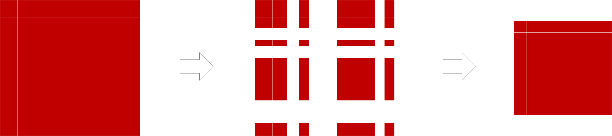

# Intro BI (32321/1700/1920/1/27)

## Transformations

### Why Transforming Data

Data generally needs to be transformed somehow. There are several possible reasons to transform the data:

- Adopt the naming conventions of the EDM (Enterprise Data Model)
- Standardize primary and foreign keys
- Avoid confusion and ambiguity by human or by machines
- Abide by the rules of the statistical software or other software
- Adopt to good practices in the field
- Adhere to standardizations of regulatory bodies

### Subsetting or Slicing

These actions can simply be summarized as filtering out instances and/or features of a data table. Which features to remove has typically been decided already early in the EDA. Sometimes, however, there are sometimes justifications for removing instances as well:

- Contains many outliers that can be explained or that are beyond doubt
- The instance is otherwise unreliable even without outliers
- The instance must be removed for privacy reasons
- The instance falls outside the scope of the DWH

### Grouping and Aggregation

Upon Grouping the data table according to one or more features, the other variables need to be aggregated en this can be done using:

- Selection (first, last, second value, &hellip;)
- Measures of central tendency (mean, median, &hellip;)
- Measures of dispersion (variance, range, standard deviation, IQR, &hellip;)
- Extremes (min, max)
- Counts (Count, unique count, sum, majority vote, counts of missing values, &hellip;)

### Transforming text

|Transformation|Example|Possible justification|
|-|-|-|
|Change Encoding|`UTF16` &rarr; `UTF8`|Avoid software incompatibilities|
|Change Casing|`"tfr523"` &rarr; `"TFR523"`|Avoid confusing and allow for proper comparison|
|Trim|`" TFR523"` &rarr; `" TFR523"`|Ensure proper identification & comparison|
|Add Leading zeroes|`"653"`, `"61"`, &hellip; &rarr; `"0653"`, `"0061"`, &hellip;|Avoid str/num confusion by humans and machines|
|Add prefix|`"0653"` &rarr; `"UHR0653"`|Avoid confusion with other IDs|

### Re-Scaling Numerical Values

Here are some of the countless different types of re-scaling:

- [Logarithm](https://www.medcalc.org/manual/_help/images/logtransformation.png)
- [Logit-transform](https://miro.medium.com/max/1244/1*vEiAxU_mVmFIOvf-xzTolw.png)
- Normalization to a fixed maximum value
- Standardization (to a mean of 0 and a variance of 1)
- Division by another field (e.g. `Quantity_By_Month / Days_Per_Month`, `Revenue_By_Store / Sold_By_Store`, `Quantity / Weight_Per_Unit`, &hellip;)
- Multiplication (e.g. `Quantity x Unit_Price`, `Quantity x Unit_Cost`)
- Subtraction (e.g. `Sales_value – Sales_cost`)

### Discretizations

Is going from continuous data to more discrete data. Here are some examples:

- Rounding ([2.25, 2.35] &rarr; [2.2, 2.4])
- Binning ([here](https://docs.tibco.com/pub/sfire-bauthor/7.5.0/doc/html/en-US/GUID-DE9E9072-F026-4E05-BB89-6AB803917351-display.png) and [here](https://blogs.sas.com/content/iml/files/2013/07/bin2d2.png))

Mind that 
 always leads to loss of information.

### Information Content

The information of a feature or an entire data set can be measured using indices such as the Shannon Entropy or the limiting density of discrete points.

### Reformatting, Type Conversion, Casting or Coercion

Examples:

- String to Integer or vice versa
- Reformatting date to ISO-8601 (`"07/04/2008` &rarr; `"2007-07-04" (YYYY-MM-DD)`)

### Changing numerical Values 

Far more invasive then re-scaling is when the data is changed based on some custom algorithm. An example hereof is the removal of a drift in the data (de-trending). Similarly, seasonal effects in time series data can be compensated away. Such changes can obviously impact the outcome of the analysis significantly and needs thorough justification.

### Changing Category Names

This is sometimes called **recoding** or **refactorization** and only affects nominal features. It serves to adhere to EDM, to the standards of the DWH and to ensure compatibility across data sets. Alternatively, it simply ensures that misspelled category names are being corrected and alternative spellings are being merged.

### Imputation

Imputation is the completion of missing data. Depending of the patterns the 'holes' in the data display or on prior knowledge, separate techniques exist to fill in the blanks.
