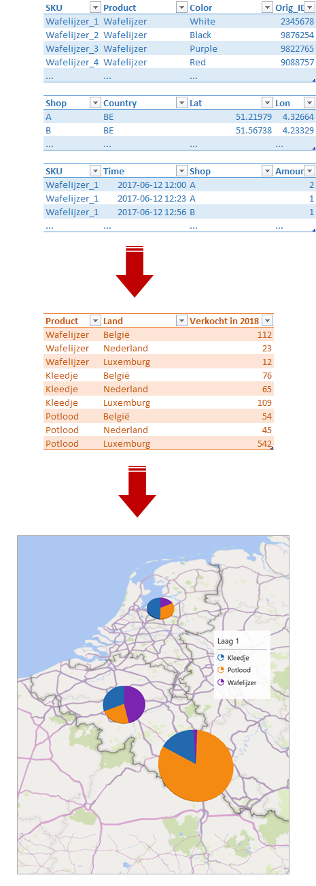
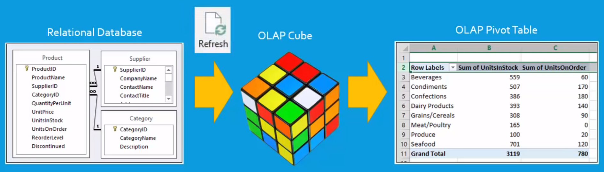
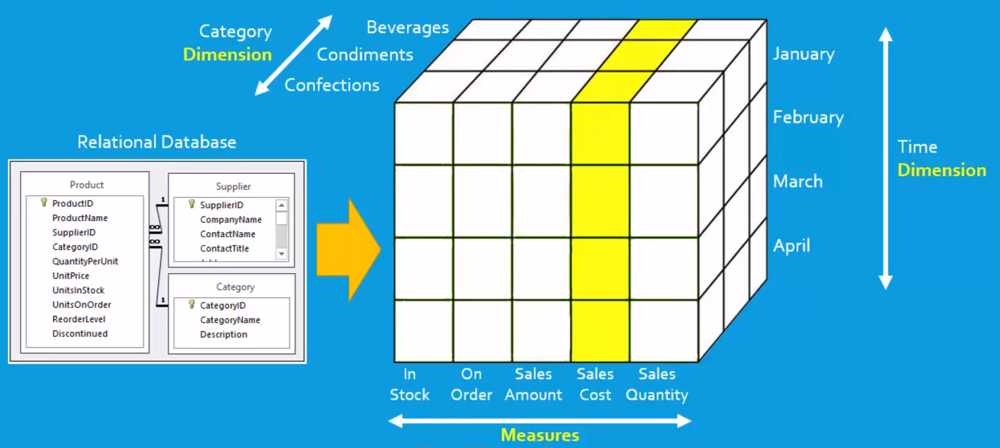

# Intro BI (32321/1700/1920/1/27)

## Data Marts

### Introductie tot Data Marts

Eerst nog eens een veralgemeend overzicht van de BI infrastructuur:

<small>[Bron](https://panoply.io/data-warehouse-guide/data-mart-vs-data-warehouse/)</small>

In een data mart gebeurt de selectie van de data uit de DWH voor een bepaalde afnemersgroep. Volgens de traditionele modellen van Inmon en Kimball mogen in een data mart en in het transport van de DWH naar de data mart geen verdere transformaties van de data plaatsvinden. Volgens het principe van data vaults is dat wel toegelaten. Het idee om de transformaties uit te stellen dient om te vermijden dat er te veel tijd wordt gespendeerd in het voorbehandelen van data die misschien niet gebruikt zal worden. Het blijft natuurlijk belangrijk om geen dingen dubbel te definiëren. Het is dus goed om een systeem op te zetten dat het mogelijk maakt om een zelfde transformatie aan te roepen vanaf meerdere data marts. Hier nog eens het verschil tussen een DWH op een rijtje:

|                | Data mart                                                                           | DWH                                                                                                                      |
| -------------- | ----------------------------------------------------------------------------------- | ------------------------------------------------------------------------------------------------------------------------ |
| Focus          | **Reporting** single subject or functional organization area                                    | **Storage** of enterprise-wide disparate data sources                                                                     |
| Data Sources   | Relatively few sources linked to one line of business                               | Many external and internal sources from different areas of an organization                                               |
| Size           | Less than 100 GB                                                                    | 100 GB minimum but often in the range of terabytes for large organizations                                               |
| Normalization  | No preference between a normalized and de-normalized structure                       | Modern warehouses are mostly de-normalized for quicker data querying and read performance                                 |
| Cost           | Typically from $10,000 upwards                                                      | Varies but often greater than $100,000; for cloud solutions costs can be dramatically lower as organizations pay per use |
| Setup Time     | 3-6 months                                                                          | At least a year for on-premise warehouses; cloud data warehouses are much quicker to set up                              |
| Data Held      | Typically data aggregations                                                           | Processed raw data, metadata, and summary data                                                                           |
| Security       | Highest possible                                                                    | High                                                                                                                     |
<small>[Bron (gedeeltelijk)](https://panoply.io/data-warehouse-guide/data-mart-vs-data-warehouse/)</small>

### Structuur

Voor het maken van een data mart, moet de architect op de volgende zaken letten:

- In een data mart mogen geen nieuwe data worden geïntroduceerd
- Een data mart is gekoppeld aan een afnemersgroep/proces
- Een data mart bevat alleen data die relevant is voor die afnemersgroep
- Het ontwerp van een data mart is op performantie toegespitst

### Voorbeeld

Laten we een sterk vereenvoudigd voorbeeld bekijken om mee te beginnen:

Het bovenste gedeelte in bovenstaande figuur (blauwe tabellen) geeft een (onvolledig) beeld van de DWH met 3 tabellen met daarin telkens aan aantal features. In het midden van bovenstaande afbeelding (oranje) vind je een voorbeeld van een draaitabel zoals die voor een bepaalde doelgroep zou kunnen dienen. Onderaan zie je de kaart waarop de inhoud van de draaitabel grafisch wordt voorgesteld. Daar een data mart bestemd is voor een bepaalde doelgroep of een bepaald process, zal je meerdere zulke draaitabellen/grafieken gekoppeld zien per data mart.

### Datamodel voor data marts

Daar waar de centrale databank meer genormaliseerd is, zal de data mart eerder gebruik maken van een stermodel. Zoals eerder besproken, maakt zulk een model gebruik van feitentabellen en dimensies (Kimball).

### OLAP Proces

Zoals we kunnen zien in het vereenvoudigd voorbeeld hierboven, is er voor rapportage meestal nood aan het samenvoegen van data. De geaggregeerde data wordt dus bewaard in de data mart. Het berekenen van die aggregaten is het werk van het **OLAP proces** (OLAP = Online Analytical Processing) dat 's nachts of in het weekend kan draaien. Het resultaat noemt men een OLAP kubus. De kubus is net als een draaitabel het resultaat van een aggregatie over meerdere (typisch 3) dimensies. Het is een zogenaamde **snapshot** (momentopname) van een subset van de DWH en garandeert dus niet om de laatste data te bevatten.

<small>[Bron](https://www.youtube.com/watch?v=yoE6bgJv08E)</small>

In een OLAP kubus kan één van de dimensies ook vervangen worden door facts (hieronder als 'measures'). Het voorbeeld hieronder toont verscheidene hoeveelheden (in stock, besteld, som verkoop, som kost en aantal verkocht):

<small>[Bron](https://www.youtube.com/watch?v=yoE6bgJv08E)</small>

### hiërarchieën

Sommige dimensies behoren tot een hiërarchie. Dit betekent dat ze verschillende discrete niveaus van aggregatie kunnen vertonen. De meestvoorkomende hiërarchieën zijn die van de tijd, ruimte en productcategorie dimensies:

- 2002
  - Q1
    - JAN
    - FEB
    - MAR
      - W1
      - W2
      - W3
      - W4
    - APR
  - Q2
  - Q3
  - Q4
- 2003
- &hellip;

---

- Kledij
  - Mannen
    - Jassen
    - Kousen
    - Broeken
      - Spijkerbroeken
      - Broeken met gaten
      - Gaten met broek
    - Hemden
  - Vrouwen
  - Kinderen
- Voeding
- &hellip;

Het is meestal de bedoeling dat de eindgebruiker gemakkelijk kan navigeren doorheen deze hiërarchieën ('inzoomen' en 'uitzoomen').
