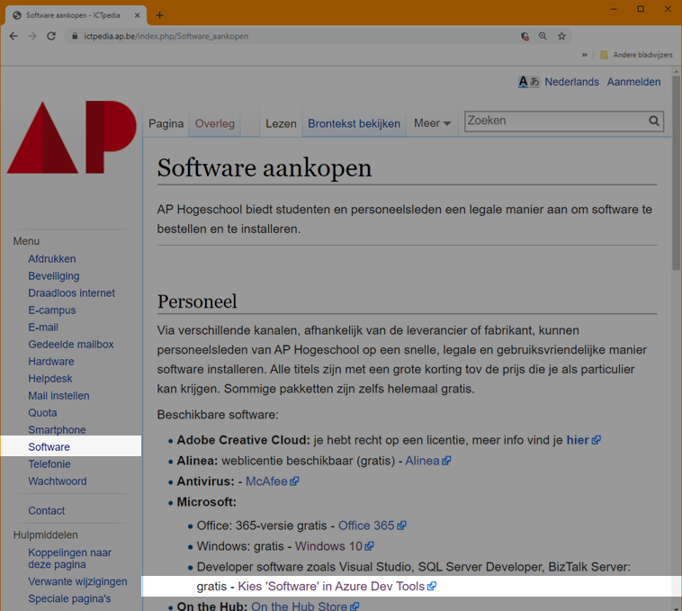
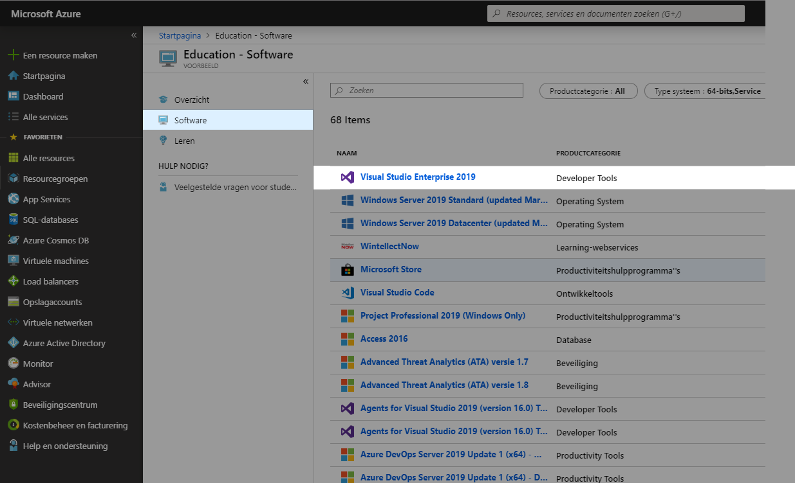
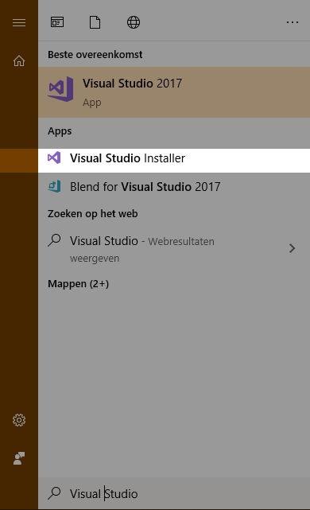
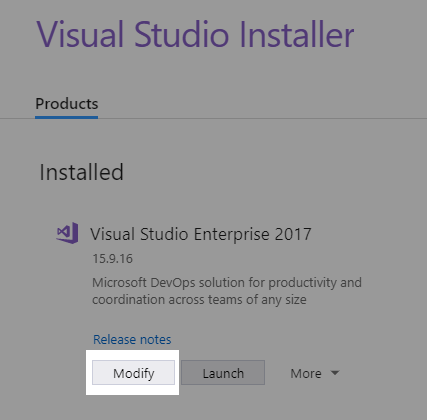
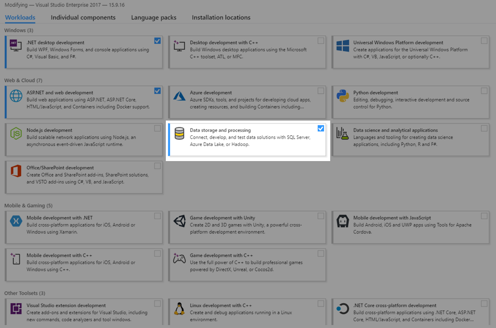
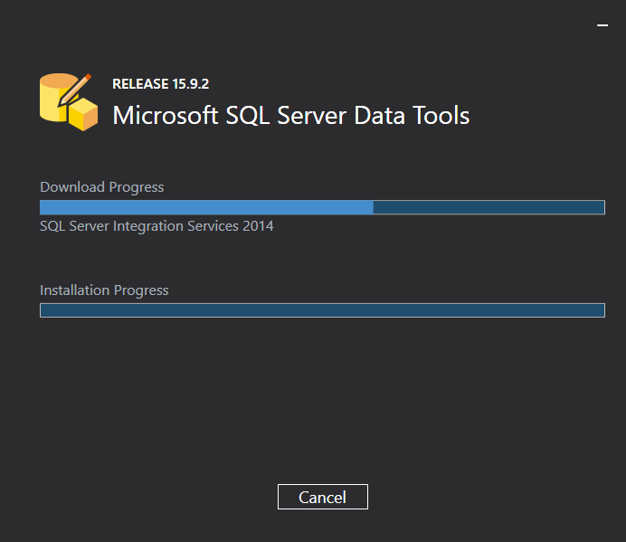
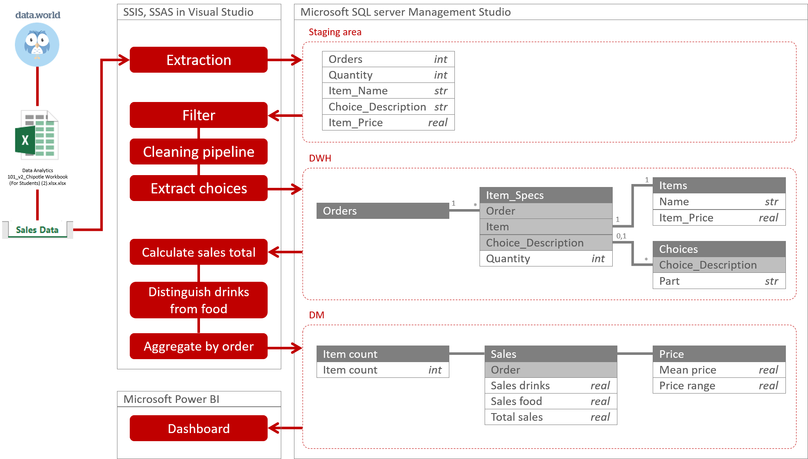

- [Excel](https://www.youtube.com/watch?v=yoE6bgJv08E)
- https://www.youtube.com/watch?v=0ikNnenDyNw

### Extra functionaliteiten

Tenslotte zijn er nog tal van andere functionaliteiten die belangrijk kunnen zijn:

- Automatische communicatie van rapporten naar meerdere afnemers
- Feedback kanaal
- Scheduling van taken zoals updating
- Converteren van rapporten naar een ander formaat

### Installatie Visual Studio (Windows)

1. Toets  + D
2. Toets  + **Visual Studio** en controleer of deze geïnstalleerd is op jouw systeem.

    Zo niet, volg je de link van [ICT Pedia](https://ictpedia.ap.be/index.php/Software_aankopen) naar de [Azure Developer Tools](https://aka.ms/devtoolsforteaching)

     

    en meld je je aan met je school-account. Daarna kies je software en kies je Visual Studio:

     

### Installatie SQL Server

3. Op gelijkaardige manier als hierboven installeer je Microsoft SQL Server, Developer Edition.

### Installatie SQL Server Data Tools (SSDT)

4. Start de Visual Studio Installer op:

    

5. Kies voor Modify:
   
    

6. Selecteer *Data storage and processing*

    

Bij het aanmaken van een nieuw project in Visual Studio, moet deze de mogelijkheid tonen om Business Intelligence te kiezen, naast C# en F# en ander omgevingen. Is dit niet het geval, dan moet je toch de stand alone installatie uitvoeren. Volg hiervoor (en indien je versie 2017 van Visual studio hebt) [deze](https://docs.microsoft.com/en-us/sql/ssdt/download-sql-server-data-tools-ssdt?view=sql-server-ver15#ssdt-for-vs-2017-standalone-installer) link.

### SSIS

Bestaat uit Control Flow en Data Flow elementen. Control Flow bestaat uit het plan/model om de volgorde te bepalen waarin de verscheidene stappen binnen het ETL proces uit te voeren. De Data Flow beheert de eigenlijke data transformaties.

### Power BI

Hier is een overzicht van Power BI:

Je Power BI downloaden en installeren via [deze link](https://powerbi.microsoft.com). Denk eraan om te registreren met je school-account.

### Difference confidence intervals and prediction intervals

According to [Rob Hyndman](https://robjhyndman.com/hyndsight/intervals/)

### EDM

EDM staat voor Enterprise Data Model.
http://tdan.com/the-enterprise-data-model/5205#targetText=An%20Enterprise%20Data%20Model%20is,of%20any%20system%20or%20application.

### Example Data flow

### Extra Materiaal

[Video](https://www.youtube.com/watch?v=0ikNnenDyNw)